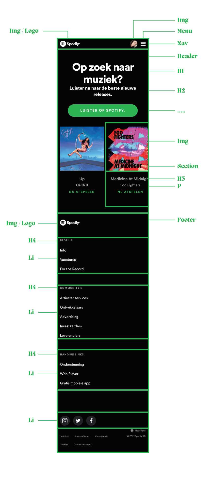
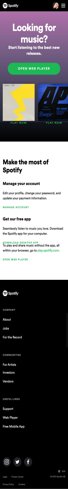
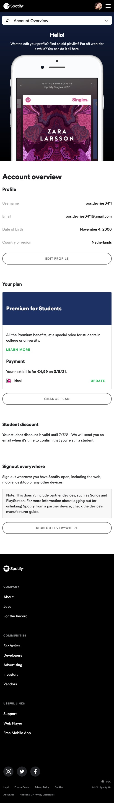

# Procesverslag
Roos de Vries – 500807652

Markdown cheat cheet: [Hulp bij het schrijven van Markdown](https://github.com/adam-p/markdown-here/wiki/Markdown-Cheatsheet). Nb. de standaardstructuur en de spartaanse opmaak zijn helemaal prima. Het gaat om de inhoud van je procesverslag. Besteedt de tijd voor pracht en praal aan je website.

## Bronnenlijst
1. -bron 1-
2. -bron 2-
3. -...-

## Eindgesprek (week 7/8)

-dit ging goed & dit was lastig-

**Screenshot(s):**

-screenshot(s) van je eindresultaat-

## Voortgang 3 (week 6)

-same as voortgang 1-

## Voortgang 2 (week 5)

-same as voortgang 1-

## Voortgang 1 (week 3)

### Stand van zaken

-dit ging goed & dit was lastig-

**Screenshot(s):**

-screenshot(s) van hoe ver je bent met korte uitleg-

### Agenda voor meeting

-samen met je groepje opstellen-

| student 1      | student 2          | student 3    | student 4        |
| ---            | ---                | ---          | ---              |
| dit bespreken  | en dit             | en ik dit    | en dan ik dat    |
| an dat ook nog | dit als er tijd is | nog een punt | dit wil ik zeker |
| ...            | ...                | ...          | ...              |

### Verslag van meeting

-na afloop snel uitkomsten vastleggen-

## Breakdownschets (week 1)

Ik had nog nooit eerder van een deze methode gehoord, maar vond dit super fijn. Ik kreeg echt het idee het allemaal wel mee valt, qua hoe veelheid, omdat alles mooi in hokjes geplaatst kon worden.

## Intake (week 1)
Aangezien ik nog niet veel ervaring heb met coderen ga ik voor de blauwe piste

Startniveau – Blauw

Ik vind responsives op websites altijd erg belangrijk want ik werk vaak met 2 of 3 schermen naast/onder elkaar. 
Hierdoor kies ik voor de responsive kan van de opdracht, maar ik wil ook meer te weten komen over CSS, en hoe ik het kan toepassen.

Gekozen website – Spotify.com

Eerste pagina – mobile screen

Detailpagine – mobile screen

